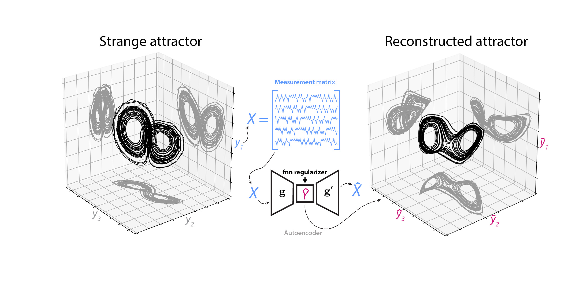

## fnn

Embed univariate or multivariate time series using autoencoders with a loss function that penalizes false-nearest-neighbors.

This package includes alternative embedding methods using lag based on the average mutual information, Eigen-time-delay coordinates (ETD), and time-lagged independent component analysis (tICA).

For more information about the technique, please see the following reference. If using this code, please consider citing the paper.

> Gilpin, William. "Learning strange attractors from time series" 2020. [https://arxiv.org/abs/2002.05909](https://arxiv.org/abs/2002.05909)

# Installation

This library requires the following packages

+ Numpy
+ Scipy
+ Tensorflow 2.0 or greater
+ Scikit-learn
+ Matplotlib (for demos)
+ Jupyter Notebook (for demos)

To use this repository, directly download the source:

	git clone https://github.com/williamgilpin/fnn

Test that everything is working:

	python tests/test_models.py 

# Usage

+ `demos.ipynb` shows the step-by-step process of constructing embeddings of the Lorenz attractor,  experimental measurements of a double pendulum, a quasiperiodic torus, the Rössler attractor, and a high-dimensional chaotic ecosystem.
+ `compare.ipynb` trains an LSTM and MLP with the FNN regularizer, as well as comparison models with tICA and ETD.
+ `exploratory.ipynb` applies the embedding technique to several time series datasets with unknown attractors.

# Dataset sources

The folder `datasets` contains abridged versions of several time series datasets used for testing and evaluating the code. We summarize these files, and provide their original sources, here:
+ `geyser_train_test.pkl` corresponds to detrended temperature readings from the main runoff pool of the Old Faithful geyser in Yellowstone National Park, downloaded from the [GeyserTimes database](https://geysertimes.org/).  Temperature measurements start on April 13, 2015 and occur in one-minute increments. 
+ `electricity_train_test.pkl` corresponds to average power consumption by 321 Portuguese households  between 2012 and 2014, in units of kilowatts consumed in fifteen minute increments. This dataset is from the [UCI machine learning database](http://archive.ics.uci.edu/ml/datasets/ElectricityLoadDiagrams20112014).
+ `pendulum_train.pkl` and `pendulum_test.pkl` correspond to two different double pendulum experiments, taken from a series of experiments by [Asseman et al.](https://developer.ibm.com/exchanges/data/all/double-pendulum-chaotic/). In Asseman et al.'s original study, pendula were filmed, and the $(x,y)$ positions of centroids were detected. Here, we have converted the dataset into canonical Hamiltonian coordinates $(\theta_1, \theta_2, \dot\theta_1, \dot\theta_2)$.
+ `ecg_train.pkl` and `ecg_test.pkl` correspond to ECG measurements for two different patients, taken from the [PhysioNet QT database](https://physionet.org/content/qtdb/1.0.0/)
+ `mouse.pkl` A time series of spiking rates for a neuron in a mouse thalamus. Raw spike data was obtained from [CRCNS](http://crcns.org/data-sets/thalamus/th-1/about-th-1) and processed with the authors' code in order to generate a spike rate time series.

Some functions used for baselines in this repository have been adapted from code in other repositories. We have included these files here directly, in order to reduce dependencies. However, if using these portions of this code in future work, please heed their licenses and attribution requirements:
+ The file `tica.py` is a standalone version of the tICA implementation in [MSMBuilder](https://github.com/msmbuilder/msmbuilder)